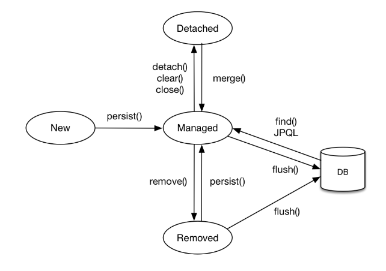

# 지연로딩과 즉시로딩의 차이

---

## 즉시로딩 (EAGER)

**즉시로딩**이란 데이터를 조회할 때, 연관된 모든 객체의 데이터까지 한 번에 불러오는 것이다.

`xxToxx(fetch = FetchType.EAGER)` 형태로 사용된다.

Member 엔티티와 Team 엔티티가 N:1 매핑

```java
@Entity
public class Member {

    @Id @GeneratedValue
    private Long id;
    private String username;

    @ManyToOne(fetch = FetchType.EAGER) //Team을 조회할 때 즉시로딩을 사용하곘다!
    @JoinColumn(name = "team_id")
    Team team;
}

@Entity
public class Team {

    @Id @GeneratedValue
    private Long id;
    private String teamname;
}
```

JPQL로 Member 1건 조회를 하게 되면 Member 조회하는 시점에 바로 Team까지 불러오는 쿼리를 날려 한꺼번에 데이터를 불러오는 것을 볼 수 있다.
```SQL
//멤버를 조회하는 쿼리
select
    member0_.id as id1_0_,
    member0_.team_id as team_id3_0_,
    member0_.username as username2_0_ 
from
    Member member0_

//팀을 조회하는 쿼리
select
    team0_.id as id1_3_0_,
    team0_.name as name2_3_0_ 
from
    Team team0_ 
where
    team0_.id=?
```
---

## 지연로딩 (LAZY)

**지연로딩**이란, 필요한 시점에 연관된 객체의 데이터를 불러오는 것이다.

쿼리 실행 시, select 쿼리 대신 proxy 객체를 만들어 엔티티에 적용한다.

그 후, 해당 proxy 객체가 호출될 때마다 select 쿼리가 전송된다.

`xxToxx(fetch = FetchType.LAZY)` 형태로 사용된다.

위에 똑같은 예제에 JPQL로 Member 조회하면 Member만 불러온다.
```SQL
//Team을 조회하는 쿼리가 나가지 않음!
select
    member0_.id as id1_0_,
    member0_.team_id as team_id3_0_,
    member0_.username as username2_0_ 
from
    Member member0_
```
---

## 즉시 로딩 vs 지연 로딩 비교

| 구분 | 즉시 로딩 (EAGER) | 지연 로딩 (LAZY) |
|------|-----------------|----------------|
| **로딩 시점** | 엔티티 조회 시 연관된 모든 데이터를 함께 로딩 | 연관된 데이터를 실제 사용하려는 시점에 로딩 |
| **장점** | 필요한 모든 데이터가 한 번에 로드되어 편리함 | 초기 로딩 속도가 빠르고 불필요한 데이터 로딩을 피할 수 있음 |
| **단점** | 불필요한 데이터를 로드하여 성능이 저하될 수 있고 N+1 문제 발생 가능성이 높음 | 연관된 객체를 사용하려 할 때 추가적인 로딩이 필요함 (성능 저하 가능성) |
| **주요 활용** | 대부분의 경우 성능 저하의 원인이 될 수 있어 사용에 주의가 필요함 | JPA에서는 일반적으로 지연 로딩을 기본으로 사용하고, 필요할 때만 즉시 로딩을 선택하는 것이 권장됨 |
| **대표 설정** | `@ManyToOne(fetch = FetchType.EAGER)` | `@ManyToOne(fetch = FetchType.LAZY)` |

# JPQL 정리

---

## **JPQL**

- **JPQL**은 **엔티티 객체를 대상으로 하는 객체 지향 쿼리 언어**
- SQL처럼 보이지만, **테이블이 아니라 엔티티(Entity)**를 대상으로 동작
- JPQL은 SQL과 비슷하게 `SELECT`, `UPDATE`, `DELETE` 문을 사용할 수 있지만 `INSERT`는 없다.  
  (엔티티 저장 시 `EntityManager.persist()` 메서드 사용)


  **예시**
```java
SELECT m FROM Member AS m where m.username = 'Hello'
```
- **대소문자 구분**
    - 엔티티와 속성은 대소문자를 구분하지만, `SELECT`, `FROM`과 같은 JPQL 키워드는 대소문자 구분하지 않음

- **엔티티 이름**
  - 엔티티 명은 `@Entity(name="xxx")`로 지정하거나, 클래스 명을 기본으로 사용

- **별칭은 필수**
  - `Member AS m`에서 Member에 `m`이라는 별칭 부여
  - JPQL은 별칭을 **반드시 사용**
  - `AS`는 생략 가능

---

## **TypedQuery와 Query**

- **JPA에서 JPQL 쿼리 결과 타입을 어떻게 다루느냐**에 따라 구분
    - 쿼리 객체 반환 타입이 명확하면 `TypedQuery`
    - 명확하지 않으면 `Query` 사용

1️⃣ `TypedQuery` — **결과 타입이 명확할 때 사용**
```java
// Member 엔티티 전체를 조회
TypedQuery<Member> query =
    em.createQuery("SELECT m FROM Member m WHERE m.name = :name", Member.class);

query.setParameter("name", "민규");

List<Member> result = query.getResultList();
```
- `Member.class`를 지정했기 때문에 **타입이 확실히 보장됨**

2️⃣ `Query` — **결과 타입이 명확하지 않을 때 사용**
```java
// 여러 타입(엔티티 + 값)이 섞여 있는 결과
Query query = em.createQuery("SELECT m.name, m.age FROM Member m");

List<Object[]> result = query.getResultList();

for (Object[] row : result) {
    System.out.println("이름: " + row[0] + ", 나이: " + row[1]);
}
```
- 결과가 여러 컬럼이라 **타입 추론 불가**

---

## **결과 조회**

| 항목 | getResultList() | getSingleResult() |
|------|----------------|-----------------|
| 반환 타입 | List | 단일 객체 |
| 결과 없음 | 빈 리스트 반환 | 예외 발생 (NoResultException) |
| 결과 여러 개 | 전부 반환 | 예외 발생 (NonUniqueResultException) |
| 사용 상황 | 여러 건 혹은 0건 가능성 있을 때 | 결과가 반드시 1건일 때 (ex. ID 조회) |

---

## **파라미터 바인딩**

- JPQL 쿼리 안에 값을 직접 넣지 않고 **변수(파라미터)**로 전달해서 값을 나중에 지정하는 방법
```java
SELECT m FROM Member m WHERE m.name = '민규'
```
- 문자열로 직접 값을 넣는 대신👇 
```java
SELECT m FROM Member m WHERE m.name = :name
```

**바인딩 방식 두 가지**

1️⃣ **이름 기준 바인딩 (Named Parameter) — ✅ 권장 방식**  
```java
String jpql = "SELECT m FROM Member m WHERE m.name = :name AND m.age = :age";

List<Member> members = em.createQuery(jpql, Member.class)
    .setParameter("name", "민규")  // :name에 바인딩
    .setParameter("age", 25)       // :age에 바인딩
    .getResultList();
```
2️⃣ 위치 기준 바인딩 (Positional Parameter) — ⚠️ 비추천
```java
String jpql = "SELECT m FROM Member m WHERE m.name = ?1 AND m.age = ?2";

List<Member> members = em.createQuery(jpql, Member.class)
        .setParameter(1, "민규")  // ?1
        .setParameter(2, 25)      // ?2
        .getResultList();
```

---

## **프로젝션(Projection)이란**

- `SELECT` 절에 조회할 대상을 지정하는 것
- 즉, **"어떤 데이터를 뽑아올지"** 정하는 것

| 종류 | 예시 | 반환 타입 | 특징 |
|------|------|-----------|------|
| 엔티티 프로젝션 | `SELECT m FROM Member m` | `List<Member>` | 영속성 컨텍스트 관리 |
| 임베디드 타입 | `SELECT m.address FROM Member m` | `List<Address>` | 값 타입, 비영속 |
| 스칼라 타입 | `SELECT m.name, m.age FROM Member m` | `List<Object[]>` | 기본값만 조회 |
| DTO 프로젝션 | `SELECT new com.example.MemberDTO(m.name, m.age)` | `List<MemberDTO>` | 실무용, 타입 안전 |

- 임베디드 타입은 엔티티 내에 `@Embedded` 타입으로 선언된 값

---

## **JPQL JOIN 예시** 
```java
SELECT m FROM Member m JOIN m.team t WHERE t.name = :teamName
```
→ 실제 SQL로 변환 시
```SQL
SELECT m.*
FROM member m
JOIN team t ON m.team_id = t.id
WHERE t.name = '개발팀';
```
---

# **Fetch Join**

---


  **Fetch join**의 가장 단순한 뜻은 연관관계의 엔티티나 컬렉션을 프록시(가짜 객체)가 아닌 진짜 데이터를 한번에 같이 조회하는 기능

- 엔티티 member는 team과 다 : 1 연관관계이고 지연로딩으로 설정  
```java
@Entity @Getter @Setter
@NoArgsConstructor(access = AccessLevel.PROTECTED)
@ToString(exclude = "memberes")
public class Team {

    @Id
    @GeneratedValue
    @Column(name = "team_id")
    private Long id;

    private String name;

    //team은 여러개의 member를 가질 수 있겠지? 그래서 oneToMany
    @OneToMany(mappedBy = "team") //xxxToMany는 디폴트가 Lazy관계
    private List<Member> members = new ArrayList<>();

    public Team(String name) {
        this.name = name;
    }
}
```
  밑의 코드는 team을 조회하면서 fetch join으로 member엔티티까지 select해온다
```java
// TeamRepository.java
@Query("SELECT distinct t FROM Team t join fetch t.members")
public List<Team> findAllWithMemberUsingFetchJoin();
```
**그럼 만약 지연로딩에서 Fetch Join이 아닌 일반 join을 하면 어떤 일이 일어날까?**


### 일반 Join

- 일반Join을 사용 보면
```java
TeamRepository.java
@Query("SELECT distinct t FROM Team t JOIN t.members")
public List<Team> findAllWithMembersUsingJoin();
```
```java
 select
         distinct team0_.id as id1_1_,
         team0_.name as name2_1_
    from team team0_ 
    inner join
        member members1_
            on team0_.id=members1_.team_id
```
team과 member가 join되어 쿼리가 실행되지만 가져오는 컬럼들은 Team의 컬럼만을 가져오고 있다.
그 이유는 fetch join과 일반 join의 차이가 있기 때문이다.
- 일반 JOIN : Fetch Join과 달리 연관 Entity에 Join을 걸어도 실제 쿼리에서 SELECT 하는 Entity는 오직 **JPQL에서 조회하는 주체가 되는 Entity만 조회하여 영속화**

- FETCH JOIN: 조회의 주체가 되는 Entity 이외에 Fetch Join이 걸린 **연관 Entity도 함께 SELECT 하여 모두 영속화**

그래서 결과적으로 일반 join을 하게 되면 나중에 추가 쿼리가 발생한다.
- 일반 Join : join 조건을 제외하고 **실제 질의하는 대상 Entity에 대한 컬럼**만 SELECT
- Fetch Join : 실제 질의하는 대상 Entity와 **Fetch join이 걸려있는 Entity를 포함한 컬럼 함께** SELECT

---

### 조심할 점

- 한 번에 여러 컬렉션 Fetch Join 금지,
```java
select t from Team t
join fetch t.members
join fetch t.orders   // ❌
```
페이징(setFirstResult, setMaxResults)이 안 된다

---

# **@EntityGraph**

---

- **@EntityGraph**

  **EntityGraph**는 지연 로딩을 유지하면서도, 특정 조회 시에만 **연관 엔티티를 즉시 함께 로딩**하도록

  선언적으로 지정할 수 있는 JPA 기능입니다.

---

## EntityGraph 사용법

1️⃣ `@EntityGraph` 어노테이션 사용
```java
//공통 메서드 오버라이드
@Override
@EntityGraph(attributePaths = {"team"}) 
List<Member> findAll();
실행 시, 내부적으로 fetch join이 자동으로 적용

//JPQL + 엔티티 그래프 
@EntityGraph(attributePaths = {"team"}) 
@Query("select m from Member m") 
List<Member> findMemberEntityGraph();

//메서드 이름으로 쿼리에서 특히 편리하다. 
@EntityGraph(attributePaths = {"team"})
List<Member> findByUsername(String username)
```
- 이 기능을 사용하면 JPQL 없이 페치 조인을 사용할 수 있다.

2️⃣ Named EntityGraph 사용 (엔티티에 정의)
```java
@Entity
@NamedEntityGraph(name = "Member.withTeam",
        attributeNodes = @NamedAttributeNode("team"))
public class Member { ... }
```
```java
@EntityGraph(value = "Member.withTeam")
List<Member> findAll();
```

---

# **commit과 flush 차이점**

---

- **flush()**

    - 영속성 컨텍스트의 변경사항을 **즉시 데이터베이스에 반영(동기화)**하는 역할
    - 즉, 데이터베이스와 영속성 컨텍스트 사이의 스냅샷을 일치시키는 작업
  
    ※ 스냅샷 : 엔티티를 영속성 컨텍스트에 보관할 때, 최초 상태를 복사해서 저장해두는 것
    - 다만, **트랜잭션을 커밋하지는 않는다**
        - 에러 발생 시 ROLLBACK이 가능한 단계까지만 반영
    - flush()가 호출되면 변경된 엔티티가 **SQL로 변환되어 실행**되지만, 트랜잭션이 끝난 것은 아님

- **commit()**

    - 현재 트랜잭션을 완료하고 모든 변경 사항을 확정
    - 내부적으로 **flush()를 수행한 후, 실제로 트랜잭션을 커밋**
    - commit()이 실행되면 변경 사항이 영구적으로 저장되며 ROLLBACK 불가
```java
@Transactional
public void example() {
    Member member = new Member("민규");
    em.persist(member);  // ① 영속성 컨텍스트에 저장 (아직 DB X)
    
    em.flush();          // ② SQL 즉시 실행 (DB INSERT 발생)
                         // 하지만 트랜잭션은 아직 커밋 전!
    
    em.commit();         // ③ 트랜잭션 commit → DB에 확정
}
```
- 예시: `em.persist(member)`
    - DB에는 아직 아무 일도 안 일어남
    - **영속성 컨텍스트(메모리)** 에만 저장됨

---

# **QueryDSL, OpenFeign의 QueryDSL**

---

- **QueryDSL이란**  
  오픈소스 프로젝트로 JPQL을 Java 코드로 작성할 수 있도록 하는 라이브러리이다.

---

## QueryDSL을 사용하는 이유

1. **자바 코드로 쿼리를 작성함으로 컴파일 시점에 에러를 잡을 수 있다.**
    - 기존 JPQL은 쿼리를 문자열로 작성해야 한다.
    - 오타나 잘못 작성해도 컴파일 시점에 에러가 발생하지 않고 런타임 시점에 발생하기 때문에 실행 전에는 문제를 알 수 없음

2. **복잡한 동적 쿼리를 쉽게 다룰 수 있다.**
    - JPQL을 이용해 동적 쿼리를 다루기 위해서는 문자열을 조건에 맞게 조합해야 한다.
    - 이는 코드도 복잡해지고 런타임 에러를 발생시키는 치명적인 단점이 있음

 사용 예시 
```java
JPAQueryFactory queryFactory = new JPAQueryFactory(entityManager);
QMember member = QMember.member;

List<Member> result = queryFactory
    .selectFrom(member)      // SELECT * FROM member
    .where(member.age.gt(20))// WHERE member.age > 20
    .orderBy(member.username.asc())
    .fetch();
```
 ➡️ 실제 SQL로 변환되면
```java
SELECT * FROM member WHERE age > 20 ORDER BY username ASC;
```
## **QueryDSL 개발 중단 이후, OpenFeign QueryDSL로의 전환 배경**

1. QueryDSL 보안 취약점
2. QueryDSL 프로젝트는 공식적으로 개발 중단을 선언하지는 않았으나, 2024년 1월 29일 발표된 5.1.0 버전을 마지막으로 새로운 릴리스가 없음
    - 기능 추가나 개선 작업 사실상 중단
3. OpenFeign팀의 QueryDSL 버전 업데이트 지원

---

## **Querydsl vs OpenFeign Querydsl**

1. Querydsl ≠ OpenFeign Querydsl
    - Querydsl 의존성: `com.querydsl`
    - OpenFeign Querydsl 의존성: `io.github.openfeign.querydsl`

2. Spring Boot는 기본 Querydsl만 관리
    - OpenFeign Querydsl 사용 시, `pom.xml`에서 버전을 명시적으로 선언 필요

---

# **N+1 문제 해결할 수 있는 여러 방안들**

---

## 1. **Fetch Join 사용하기**

Fetch Join은 JPQL을 사용하여 처음 부모 엔티티를 데이터베이스에서 데이터를 조회할 때부터 Join 쿼리를 발생시켜 연관된 데이터까지 같이 가져오는 방법
```java
@Query("SELECT m FROM Member m JOIN FETCH m.orders")
List<Member> findAllWithOrders();
// @Query 어노테이션을 사용하여 별도의 메서드를 만들어주어야 한다.
```
### 장점
**Fetch Join**은 ORM에서 사용되는 기법으로, 데이터베이스 스키마를 엔티티로 변환하고 영속성 컨텍스트에 저장한다.  
Fetch Join을 통해 연관된 엔티티를 한 번의 쿼리로 조회하면, 연관 관계는 영속성 컨텍스트의 1차 캐시에 저장되어 이후에 추가 쿼리 없이 데이터를 가져와 성능이 향상된다.

### 단점
1. **페이징에서 사용이 제한된다**
    - 컬렉션을 포함한 **Fetch Join**을 사용하면 여러 테이블을 조인하여 결과를 가져올 때, 컬렉션의 모든 데이터를 메모리에 로드한 후, 애플리케이션 레벨에서 필요한 페이지만큼 반환하게 된다.
    - 이렇게 되면 사실상 페이징의 목적이 없어지는 것과 마찬가지이다.
    - 예: 100만건의 데이터 중 10건만 페이징하려고 했더라도 100만건을 모두 메모리에 로드하게 되어 OOM(: Out Of Memory) 발생 가능성이 높아진다.

2. **1:N 관계에서 중복 데이터 발생 가능**
    - SQL 쿼리에서 다수의 컬렉션을 한 번에 조인할 경우, 조인 결과가 예상치 못하게 중복되거나 데이터가 의도하지 않은 방식으로 결합되어 잘못된 결과가 발생할 수 있다.
    - 따라서 ~ToMany 컬렉션 조인이 2개 이상을 Fetch Join할 경우, 너무 많은 값이 메모리로 들어와 `MultipleBagFetchException`이 발생한다.
    - 이는 2개 이상의 bags, 즉 컬렉션 조인이 두 개 이상일 때 발생하는 Exception이다.

---

## 2. **@EntityGraph 사용하기**

- **@EntityGraph**를 사용하면 기본 Lazy 로딩 설정을 무시하고 연관된 엔티티를 Eager 로딩하도록 설정할 수 있다.
```java
@EntityGraph(attributePaths = {"users", "events"})
@Query("SELECT t FROM Team t WHERE t.id = :id")
Team findTeamByIdWithUsersAndEvents(@Param("id") Long id);
//Team 엔티티를 조회할 때 @EntityGraph를 사용하여 users와 events 엔티티들을 함께 로드한다.
```
### Fetch Join vs @EntityGraph

- **@EntityGraph**는 FetchType을 EAGER로 설정하여 LEFT OUTER JOIN을 수행하는 반면, **Fetch Join은 기본적으로 INNER JOIN**을 사용한다.
- Fetch Join은 연관된 데이터가 없는 부모 엔티티가 결과에서 제외될 수 있으며, 여러 엔티티를 동시에 조인하기 어렵다.
- 반면, **EntityGraph는 LEFT JOIN을 사용하기 때문에 연관 데이터의 유무와 관계없이 부모 엔티티를 포함할 수 있어**, 이러한 제약이 없다.
- 다만, **EntityGraph 역시 페이징 시에는 예상과 다르게 동작할 수 있음에 유의**해야 한다.

---

## 3. **BatchSize 설정**

- Lazy Loading 시 프록시 객체를 조회할 때 WHERE IN 절로 묶어서 한 번에 조회할 수 있게 해주는 옵션
```java
@Entity
public class ParentEntity {

    @BatchSize(size = 20)
    //이건 SELECT * FROM child_entity WHERE parent_id IN (1, 2, 3, ..., 20);
    @OneToMany(mappedBy = "parent")
    private Set<ChildEntity> children;
}

spring:
  jpa:
    properties:
        default_batch_fetch_size: 100
```
- **단점:** Batch Size 설정 시 몇 번의 쿼리가 더 발생할 수 있다.
- **장점:** Fetch Join과 @EntityGraph에서 발생하는 페이징 문제를 해결할 수 있다.

---

# **영속 상태의 종류**

---

## 1. 비영속(Transient) 상태
- 아직 영속성 컨텍스트에 저장되지 않은 상태
```java
Member member = new Member();
member.setName("Minkyu");
```
- 단순히 `new` 로 생성한 객체로, JPA와는 **아무 관련이 없는 상태**
- 데이터베이스에 저장되지 않음
- `EntityManager.persist()`를 호출해야 영속 상태로 전환됨

---

## 2. 영속(Managed) 상태
- 영속성 컨텍스트가 관리하는 상태
```java
entityManager.persist(member);
```
- 이 객체는 JPA가 관리함
- 1차 캐시에 저장되어 조회 시 같은 객체를 반환 (동일성 보장)
- 트랜잭션이 커밋될 때 DB에 자동 반영됨 (Dirty Checking)

---

## 3. 준영(Detached) 상태
- 한때 영속 상태였지만, 이제는 영속성 컨텍스트에서 분리된 상태
```java
entityManager.detach(member);
```
- 더 이상 변경 감지되지 않음
- flush되지 않음 (DB 반영 X)
- 필요 시 `merge()`로 다시 영속 상태로 복귀 가능

---

## 4. 삭제(Removed) 상태
- 삭제가 예약된 상태
```java
entityManager.remove(member);
```
- 트랜잭션 커밋 시 DELETE SQL 실행
- 영속성 컨텍스트에서도 제거됨
- 다시 `persist()`하면 영속 상태로 복귀 가능

