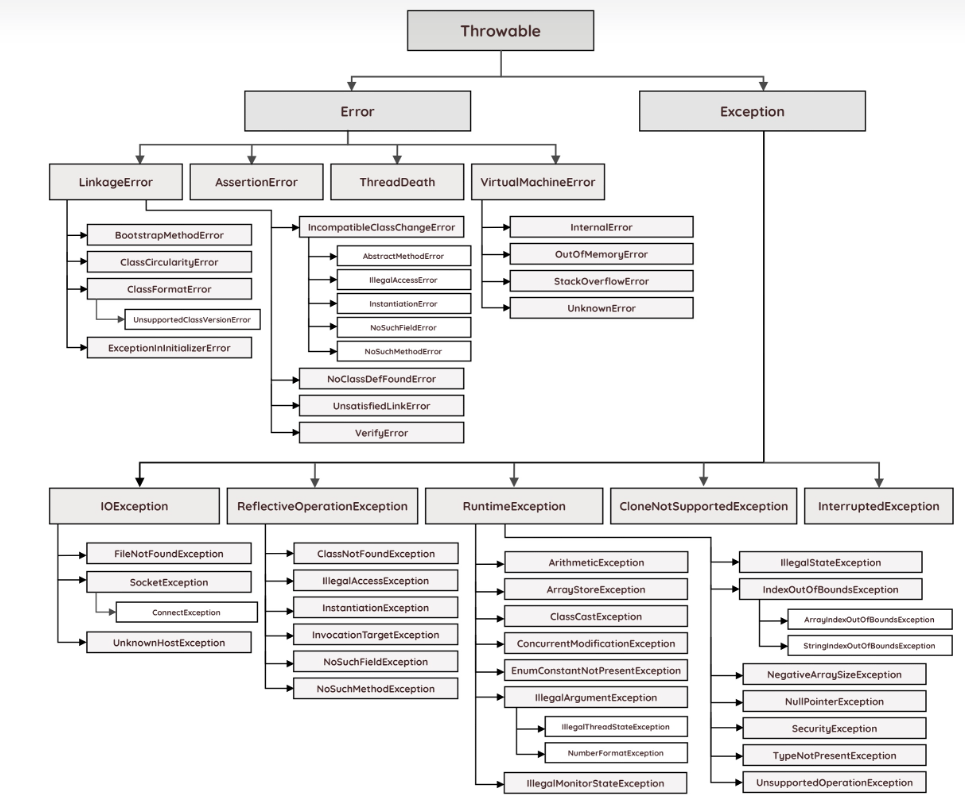
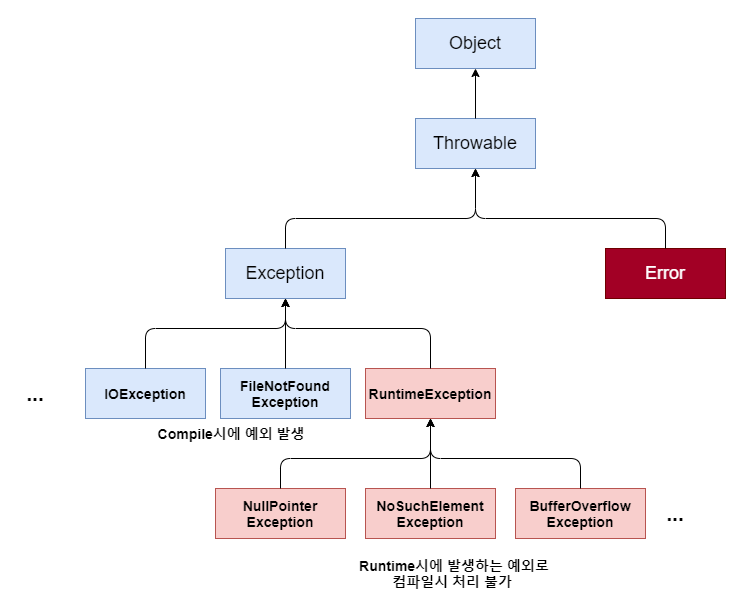

# 🌱 Java의 Exception 종류 정리

자바의 오류 클래스 계층 구조를 살펴보면 다음과 같이 구성 되어 있다.



여기서 **Error** 클래스는 외부적인 요인으로 발생하는 오류이기 때문에 개발자가 대처할 수는 없다.

---

## 🧩 Throwable 클래스란?

오류와 예외 모두 자바의 최상위 클래스인 **Object**를 상속받는다.  
그리고 그 사이에는 **Throwable** 클래스와 상속관계가 있는데,  
Throwable 클래스의 역할은 오류나 예외에 대한 메시지를 담는 것이다.

대표적으로 아래 메서드들이 포함된다:

- `getMessage()`
- `printStackTrace()`

따라서 Throwable을 상속받은 Error와 Exception 클래스에서도  
위 두 메서드를 사용할 수 있게 된다.

모든 예외 클래스는 **java.lang.Exception** 클래스를 상속받는다.

Exception 클래스는
- **RuntimeException (런타임 예외)**
- **그 외 컴파일 예외 그룹**

으로 구성된다.



---

## ⚠️ Exception 종류

### ✔ Exception 및 하위 클래스 (컴파일 예외)
사용자의 실수와 같은 외적인 요인으로 발생.

- 존재하지 않는 파일의 이름 입력 — *FileNotFoundException*
- 실수로 클래스 이름 잘못 기재 — *ClassNotFoundException*
- 입력 데이터 형식 오류 — *DataFormatException*

### ✔ RuntimeException (런타임 예외)
프로그래머의 실수로 발생.

- 배열 범위 벗어남 — *IndexOutOfBoundsException*
- null 참조 멤버 호출 — *NullPointerException*
- 잘못된 형변환 — *ClassCastException*
- 0으로 나누는 연산 — *ArithmeticException*

---

## 🧵 Checked Exception vs Unchecked Exception

Checked Exception은 컴파일 예외 클래스들,  
Unchecked Exception은 런타임 예외 클래스들이다.

이렇게 다시 분류하는 이유는 **예외 처리 방식** 때문이다.

---

### 📌 비교표

| 구분 | **Checked Exception** | **Unchecked Exception** |
|------|---------------------------|-----------------------------|
| **처리 여부** | 반드시 처리 필요 (`try-catch`, `throws`) | 처리하지 않아도 컴파일 됨 |
| **확인 시점** | 컴파일 타임 | 런타임 |
| **예외 종류** | `RuntimeException` 제외한 모든 `Exception` | `RuntimeException` 및 하위 |
| **대표 예외** | IOException, FileNotFoundException, SQLException | NullPointerException, IllegalArgumentException, IndexOutOfBoundsException, SystemException |

---

## 🧭 예외 처리 방식

Checked Exception은 컴파일 단계에서 체크되기 때문에  
별도의 예외 처리를 하지 않으면 **컴파일이 되지 않는다**.

그래서 Checked Exception이 발생할 가능성이 있는 메소드라면
- 직접 try-catch로 처리하거나
- `throws`로 상위로 던져야 한다.

실무에서는 메서드마다 try-catch를 계속 반복하는 복잡함을 줄이기 위해  
예외를 내부에서 처리하지 않고 그대로 상위로 던지는 방식을 자주 사용한다.

그리고 이렇게 전달된 예외는  
Spring의 **@RestControllerAdvice**에서 한 번에 처리해  
일관된 예외 응답을 만드는 구조로 설계한다.  
7주차 워크북에서도 이런 방식으로 전역 예외 처리를 적용했다.

---

# ✔ @Valid와 검증 애노테이션 정리

## 🔎 @Valid

`@Valid` 애노테이션을 이용하면, 객체 안에서 들어오는 값에 대해 검증이 가능해진다.
```java
public class ProductRequest {
    
    @NotNull // 인자로 들어온 필드 값에 null 값을 허용하지 않음
    private String productName;
    
    @Email // 이메일 형식에 맞춘 값이 들어와야함
    private String email;
    
}

@RestController
public class ProductController {
    @PostMapping("/api/v1/product")
    public Product save(@Valid @RequestBody ProductRequest productRequest) {
    }
}
```
값이 올바르게 들어오지 않았다면 **MethodArgumentNotValidException** 예외와  
**400 Bad Request 상태코드**를 반환하게 된다.

---

## ⚠ @Valid 시 발생하는 Exception Handling
```java
@RestControllerAdvice
public class ApiControllerAdvice {

    @ExceptionHandler(MethodArgumentNotValidException.class)
    public ResponseEntity<Map<String, String>> handleValidationExceptions(MethodArgumentNotValidException ex){
        Map<String, String> errors = new HashMap<>();
        ex.getBindingResult().getAllErrors()
                .forEach(c -> errors.put(((FieldError) c).getField(), c.getDefaultMessage()));
        return ResponseEntity.badRequest().body(errors);
    }

}
```
(요약: 잘못된 요청 데이터는 `@Valid` 단계에서 검증 실패로 처리된다.)

---

## 🏷️ 검증 애노테이션 종류

### 문자열/값 존재 여부 관련
- **@NotBlank**
    - null이 아닌 값
    - 공백이 아닌 문자를 하나 이상 포함해야 한다.
    - **반드시 값이 존재하고 공백 제외 길이가 0보다 커야 한다.**
- **@NotEmpty**
    - null 또는 empty(빈 문자열) 금지
    - **반드시 값이 있어야 하며 길이가 0보다 커야 한다.**
- **@NotNull**
    - null 금지
    - 타입은 상관없음
- **@Null**
    - null 값 허용

---

### 숫자 범위 검증
- **@DecimalMax**  
  지정된 최댓값보다 작거나 같아야 함.
- **@DecimalMin**  
  지정된 최솟값보다 크거나 같아야 함.
- **@Max**  
  지정된 최댓값 이하.
- **@Min**  
  지정된 최솟값 이상.
- **@Positive**  
  양수만 허용.
- **@PositiveOrZero**  
  0 또는 양수.
- **@Negative**  
  음수만 허용.
- **@NegativeOrZero**  
  0 또는 음수.

---

### 날짜/시간 검증
- **@Future**  
  현재보다 미래 날짜/시간.
- **@FutureOrPresent**  
  현재 또는 미래.
- **@Past**  
  현재보다 과거 날짜/시간.
- **@PastOrPresent**  
  현재 또는 과거.

---

### 논리 검증
- **@AssertTrue**  
  항상 true 여야 함.
- **@AssertFalse**  
  항상 false 여야 함.

---

### 길이/크기 검증
- **@Size**
    - `max` → 값의 크기가 max 이하
    - `min` → 값의 크기가 min 이상

---

이 외에도 추가적인 검증 애노테이션들이 존재한다.

---

## 🚫 @Valid의 한계 — 그룹 유효성 검사 미지원

`@Valid`는 **그룹 유효성 검사(Group Validation)** 를 지원하지 않는다.  
그룹 유효성 검사는 **Create, Update 등 상황에 따라 다른 규칙을 적용하고 싶을 때** 사용하는 방식이다.

---

## 🛠 커스텀 검증 어노테이션 (Custom Validation Annotation)

Spring의 Bean Validation(Jakarta Validation)을 사용하면 표준 검증 애노테이션  
(@NotNull, @Email 등)을 사용할 수 있지만,  
애플리케이션 요구사항에 따라 직접 검증 규칙을 정의해야 하는 경우,

➡️ 개발자가 **커스텀 검증 애노테이션**을 만들 수 있다.

위에 워크북에 자세한 예시가 나와있다.

