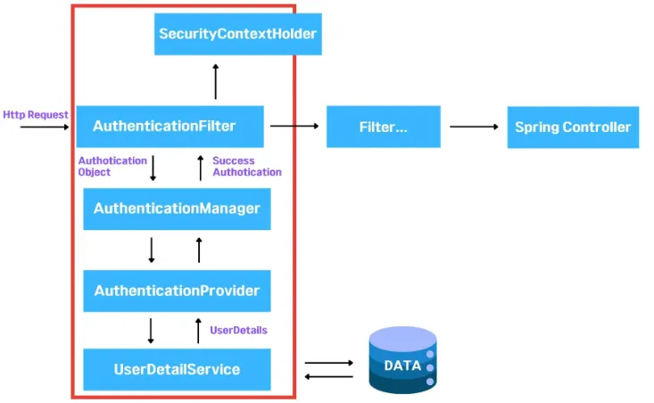
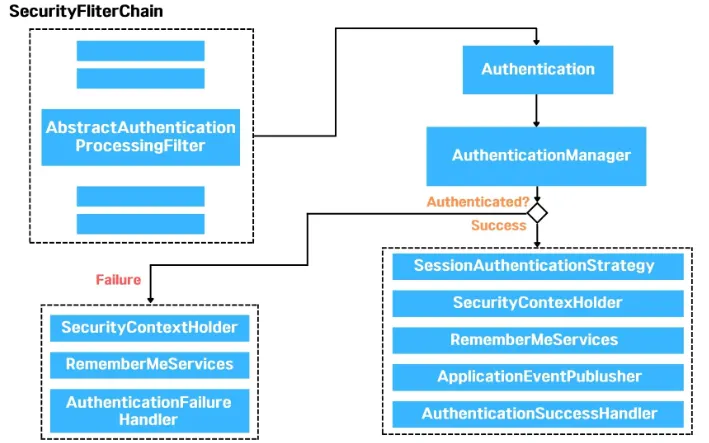
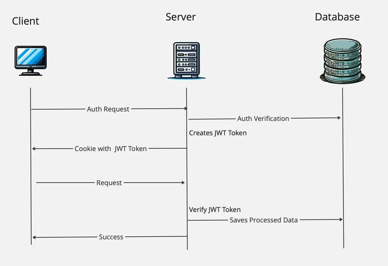
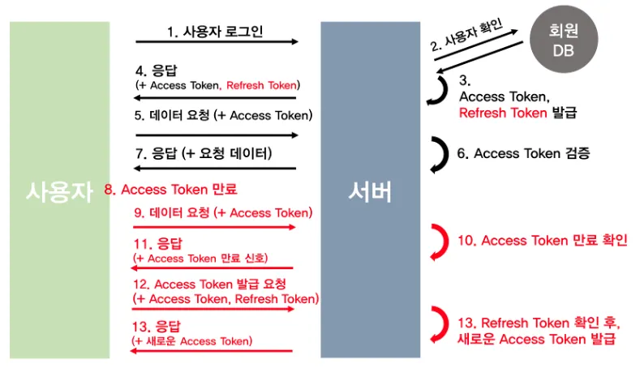

## 🔐 Spring Security란?

Spring Security는 인증, 권한 관리 그리고 데이터 보호 기능을 포함하여 웹 개발 과정에서 필수적인 사용자 관리 기능을 구현하는데 도움을 주는 Spring의 강력한 프레임워크

---

## ✨ **Spring Security를 사용하는 이유**

1.  Spring Security가 Spring의 생태계에서 보안에 필요한 기능들을 제공
2.  spring에서 추구하는 IoC/DI 패턴과 같은 확장 패턴을 염두해서 인증/인가 부분을 직접 개발

---

## 🏗️ **Spring Security 아키텍처**

1. 사용자의 요청이 서버로 들어옵니다.

2.  Authotication Filter가 요청을 가로채고 Authotication Manger로 요청을 위임합니다.

3.  Authotication Manager는 등록된 Authotication Provider를 조회하며 인증을 요구합니다.

4. 🗄 Authotication Provider가 실제 데이터를 조회하여 UserDetails 결과를 돌려줍니다.

5.  결과는 SecurityContextHolder에 저장이 되어 저장된 유저정보를 Spring Controller에서 사용할 수 있게 됩니다.

---

## ⚙️ **Spring Security가 작동하는 내부 구조**

1. 사용자가 자격 증명 정보를 제출하면, AbstractAuthenticationProcessingFilter가 Authentication 객체를 생성합니다.

2.  Authentication 객체가 AuthenticationManager에게 전달

3.  인증에 실패하면, 로그인 된 유저정보가 저장된 SecurityContextHolder의 값이 지워지고 RememberMeService.joinFail()이 실행되고 AuthenticationFailureHandler가 실행

4.  인증에 성공하면, SessionAuthenticationStrategy가 새로운 로그인이 되었음을 알리고, Authentication 이 SecurityContextHolder에 저장 이후에 SecurityContextPersistenceFilter가 SecurityContext를 HttpSession에 저장하면서 로그인 세션 정보가 저장

그 뒤로 RememberMeServices.loginSuccess()가 실행. ApplicationEventPublisher가 InteractiveAuthenticationSuccessEvent를 발생시키고  AuthenticationSuccessHandler 가 실행

---

## 🔐 인증(Authentication)과 인가(Authorization)

---

### 🪪 **인증(Authentication)과 인가(Authorization)**

**인증(Authentication): 사용자의 신원을 입증하는 과정**

즉, 사용자가 자신이 주장하는 신원을 실제로 가지고 있는지를 검증하는 단계

ex)

-  로그인 과정 : 사용자가 아이디와 비밀번호를 입력하여 자신의 계정을 확인하는 것
-  이메일 인증 : 회원 가입 시 이메일로 전송된 링크를 클릭하여 본인이 해당 이메일의 소유자임을 증명하는 것Java/Spring에서의 인증
-  Spring Security를 사용하여 사용자의 자격 증명(예: 사용자 이름과 비밀번호)을 검증합니다.
-  JWT(JSON Web Token): 사용자가 로그인하면 서버가 JWT를 발급하고, 이후 요청 시 토큰을 통해 사용자를 인증할 수 있습니다.

---

### 🛡️ **인가(Authorization): 사이트의 특정 부분에 접근할 수 있는지 권한을 확인하는 작업**

즉, 사용자가 무엇을 할 수 있는지를 제어하는 단계입니다.

ex)

-  권한에 따른 페이지 접근 : 일반 사용자는 자신의 프로필만 수정할 수 있지만, 관리자(Admin)는 모든 사용자의 정보를 수정할 수 있는 경우.
-  기능 제한 : 특정 기능(예: 데이터 삭제 기능)을 특정 역할(Role)에게만 허용하는 것.Java/Spring에서의 인가
-  역할 기반 접근 제어(Role-Based Access Control, RBAC): 사용자의 역할에 따라 접근 권한을 설정합니다.
- 🏷 @PreAuthorize 어노테이션: 메서드 레벨에서 특정 권한을 가진 사용자만 접근할 수 있도록 설정할 수 있습니다.

---

## 🔑 세션과 토큰

---

### 🗂️ **세션 기반 인증**

**세션 기반 인증**은 오래전부터 웹 애플리케이션에서 널리 사용되어 왔으며, 서버가 사용자 상태를 직접 관리하는 방식

---

### ⚙️ **동작 방식**

1.  사용자가 ID/PW 입력하여 로그인 요청
2.  서버에서 **세션 ID 생성 & 저장** (보통 데이터베이스 or 메모리 저장소 사용)
3.  세션 ID를 클라이언트 쿠키에 저장하여 이후 요청 시 서버에 전달
4.  서버는 세션 ID를 확인하고 인증 유지

---

### ✅ 장점

-  토큰 방식보다 상대적으로 구현이 쉽습니다. 인증된 유저에 세션을 생성해주고, 세션 조회를 통해 인가된 요청은 통과시키고 그렇지 않은 요청은 차단해줍니다. 세션 만료도 옵션 값만 설정해주면 처리됩니다.
-  보안 측면에서 더 유리합니다. 서버 메모리에 저장하므로, 유저의 로그인 상태를 서버에서 통제할 수 있습니다. 가령, 해킹 가능성이 있는 유저를 판별하여, 해당 sessionId를 삭제함으로써 강제로 로그아웃 시킬 수도 있죠.

---

### ❌ 단점

- ⚠️ 확장하기 위해, 별도의 작업이 필요합니다. 서버가 stateless 하지 않으므로 서버가 여러 대로 확장 됐을 때, 세션 불일치 문제가 발생하게 되는데, 이는 로그인 시 세션을 생성한 서버와 로그인 이후 요청을 받는 서버가 서로 다를 수 있기 떄문입니다. 이를 해결하기 위해서 Sticky Session, Session Clustering, 세션 스토리지 외부 분리 등의 작업을 따로 해줘야 합니다.

---

### 🪙 **토큰 기반 인증(JWT, OAuth 등)**

**토큰 기반 인증(JWT, OAuth 등)**은 최근 API 중심의 서비스에서 선호되며, 인증 정보를 토큰에 담아 클라이언트가 직접 관리하는 방식

---

### ⚙️ **동작 방식**

1.  사용자가 ID/PW 입력하여 로그인 요청
2.  서버에서 **토큰(JWT) 생성 후 클라이언트에 반환**
3.  이후 요청에서 클라이언트가 **Authorization 헤더에 토큰 포함**하여 전송
4.  서버는 토큰을 검증하고 요청을 처리

---

### ✅ 장점

-  토큰 인증 방식을 사용하면, 서버 확장이 용이합니다. 세션 방식처럼 별도의 작업이 필요하지 않습니다. 클라이언트의 LocalStorage 혹은 쿠키에 유저 정보를 포함한 토큰을 저장하기 때문에 별도의 세션이 필요하지 않아, stateless한 서버를 구성할 수 있습니다. stateless한 서버는 세션처럼 서버가 유저로부터 독립적으로 구성될 수 있습니다.

---

### ❌ 단점

-  토큰을 탈취 당했을 때, 해커의 위협으로부터 취약합니다. 사용자 토큰이 탈취되면, 세션과 다르게 이를 무효화할 수 있는 방법이 없습니다. 이에 대한 대안으로 Refresh Token을 추가로 사용할 수 있지만, Refresh Token 또한 탈취됐을 경우 요청을 막을 수 없다는 한계가 존재합니다.

---

### 🧩 세션 기반 인증이 적합한 경우

-  전통적인 웹 애플리케이션 (ex: 로그인 후 페이지 탐색)
-  소규모 프로젝트 → 서버 부담이 크지 않음
-  보안이 중요한 환경 (ex: 금융 서비스)

---

### 🌐 토큰 기반 인증이 적합한 경우

-  모바일 앱, RESTful API 서비스
- 마이크로서비스 아키텍처(MSA)
- OAuth 2.0 기반 소셜 로그인 (네이버, 구글, 카카오 로그인 등)

---

## 🔐 액세스 토큰(Access Token)과 리프레시 토큰(Refresh Token)

---

### 🪙 **액세스 토큰(Access Token)과 리프레시 토큰(Refresh Token)**

**JWT 토큰**은 유저의 **신원**이나 **권한**을 결정하는 정보를 담고 있는 데이터 조각

JWT는 탈취의 위험성이 있기 때문에, 그대로 사용하는것이 아닌 Access Token, Refresh Token 으로 이중으로 나누어 인증하는 방식을 사용

Access Token: 접근에 관여하는 토큰  
Refresh Token: 재발급에 관여하는 토큰

Access Token이 탈취되면 토큰이 만료되기 전 까지, 토큰을 획득한 사람은 누구나 권한 접근이 가능하기 때문에 보안에 취약하다. 그래서 나온게 Refresh Token이다.

---

### 🔑 **인증 방식**

1.  처음 로그인을 하면 서버는 클라이언트에게 **Access Token과 Refresh Token을 동시에 발급**해준다.
2.  서버는 **데이터베이스에 Refresh Token을 저장**하고, **클라이언트는 Access Token과 Refresh Token을 쿠키, 세션 혹은 웹스토리지에 저장**하고 요청이 있을때마다 이 둘을 헤더에 담아서 보낸다.
3.  **Refresh Token**은 긴 유효기간을 가지면서, Access Token이 만료됐을 때 **새로 재발급해주는 열쇠가 된다.**
4.  **만료된 Access Token을 서버에 보내면,** 서버는 같이 보내진 Refresh Token을 DB에 있는 것과 비교해서 일치하면 **다시 Access Token을 재발급**해준다.
5.  사용자가 **로그아웃을 하면 저장소에서 Refresh Token을 삭제**하여 사용이 불가능하도록 하고 새로 로그인하면 서버에서 다시 재발급해서 DB에 저장한다.

-  Access token과 Refresh token 모두가 만료된 경우 → 에러 발생 (재 로그인하여 둘다 새로 발급)
-  Access token은 만료됐지만, Refresh token은 유효한 경우 → Refresh token을 검증하여 Access token 재발급
-  Access token은 유효하지만, Refresh token은 만료된 경우 → Access token을 검증하여 Refresh token 재발급
-  Access token과 Refresh token 모두가 유효한 경우 → 정상 처리
-  로그아웃을 하면 Access Token과 Refresh Token을 모두 만료시킨다.

---

### 🖼️ **동작 흐름**

1.  사용자 로그인.
2.  사용자 확인, 서버에서는 회원 DB에서 값을 비교

3~4. Access Token, Refresh Token을 발급, 회원DB에도 Refresh Token을 저장

5. 사용자는 Refresh Token은 안전한 저장소에 저장, Access Token을 헤더에 실어 요청

6~7. Access Token을 검증하여 이에 맞는 데이터를 전송

8. 시간이 지나 Access Token이 만료

9. 사용자는 이전과 동일하게 Access Token을 헤더에 실어 요청

10~11. 서버는 Access Token이 만료됨을 확인하고 권한없음을 신호를 줌

> ℹ Access Token 만료가 될 때마다 계속 과정 9~11을 거칠 필요는 없다.
>
> 사용자(프론트엔드)에서 Access Token의 Payload를 통해 유효기간을 알 수 있어서 API 요청 전에 토큰이 만료됐다면 곧바로 재발급 요청을 할 수도 있다.

12. 사용자는 Refresh Token과 Access Token을 함께 서버로 전송
13.  서버는 받은 Access Token이 조작되지 않았는지 확인한후, Refresh Token과 사용자의 DB에 저장되어 있던 Refresh Token을 비교, Token이 동일하고 유효기간도 지나지 않았다면 새로운 Access Token을 발급.
14. 서버는 새로운 Access Token을 헤더에 실어 다시 API 요청 응답을 진행
